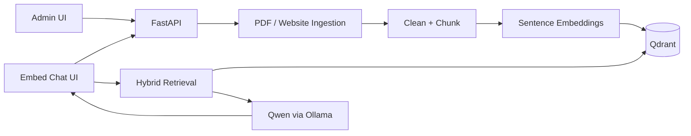

# Seirai Company Chatbot

Local-first company RAG chatbot with a Next.js frontend and a Python FastAPI backend.

```text
Developer uploads PDF or website URL
→ FastAPI extracts, cleans, chunks, embeds
→ Qdrant stores company-scoped vectors
→ user asks a question
→ hybrid retrieval + optional rerank
→ Qwen-compatible LLM generates a grounded answer with citations
→ embeddable chatbot UI displays the answer
```

## Repository layout

```text
seirai-company-chatbot/
├── frontend/                 # Next.js App Router UI
├── backend/                  # FastAPI RAG service
├── docker-compose.yml        # Qdrant (+ optional backend profile)
├── scripts/dev.sh            # helper commands
├── .env.example
└── README.md
```

## Architecture



Chunking and retrieval quality criteria (section context, ranking signals, fact-type validation, fixture tests): [docs/CHUNKING_AND_RETRIEVAL.md](docs/CHUNKING_AND_RETRIEVAL.md).

## Quick start

### 1. Start Qdrant (preferred)

```bash
chmod +x scripts/dev.sh
./scripts/dev.sh qdrant:up
```

If Docker is not installed, set `VECTOR_STORE=memory` in `backend/.env` (already the local fallback in this workspace). Memory mode is process-local and resets on restart.

### 2. Backend

```bash
./scripts/dev.sh backend:venv
cp backend/.env.example backend/.env
# edit backend/.env as needed
./scripts/dev.sh backend:dev
```

API docs: http://localhost:8000/docs  
Health: http://localhost:8000/health

### 3. Frontend

```bash
cp frontend/.env.example frontend/.env.local
./scripts/dev.sh frontend:install
./scripts/dev.sh frontend:dev
```

- Home: http://localhost:3000  
- Admin: http://localhost:3000/admin  
- Chatbot: http://localhost:3000/embed/seirai  
- Dynamic embed: http://localhost:3000/embed/{company_id}  
- Widget test: http://localhost:3000/widget-test.html  

### 4. Qwen / Ollama (for real answers)

```bash
ollama pull qwen2.5:7b
# ensure LLM_MODEL in backend/.env matches an installed model
```

If Ollama is unavailable, set:

```env
LLM_PROVIDER=deterministic
```

Deterministic mode returns grounded snippets for local testing only.

### Python note

The Dockerfile uses **Python 3.11**. This machine currently has system Python **3.9.6**; the backend runs on 3.9 for local tests. Prefer 3.11+ when available (`brew install python@3.11`).

## Environment variables

See `.env.example`, `backend/.env.example`, and `frontend/.env.example`.

Important:

| Variable | Purpose |
|---|---|
| `NEXT_PUBLIC_RAG_API_URL` | Frontend → backend base URL |
| `VECTOR_STORE` | `qdrant` (preferred) or `memory` (local fallback) |
| `QDRANT_URL` | Vector DB URL when using Qdrant |
| `EMBEDDING_PROVIDER` / `EMBEDDING_MODEL` | Local sentence-transformers by default (`hash` for tests) |
| `LLM_PROVIDER` / `LLM_BASE_URL` / `LLM_MODEL` | `ollama` (Qwen), `huggingface` (+ `HF_TOKEN`), or `deterministic` for tests |
| `HF_TOKEN` | Required when `LLM_PROVIDER=huggingface` (Inference API) |
| `CORS_ORIGINS` | Allowed browser origins |
| `ALLOWED_CRAWL_DOMAINS` | Website crawl allowlist |

## API surface

- `GET /health`
- `POST /api/documents/upload`
- `GET /api/documents?company_id=`
- `DELETE /api/documents/{document_id}?company_id=`
- `POST /api/documents/{document_id}/reprocess?company_id=`
- `POST /api/websites/ingest`
- `POST /api/retrieve`
- `POST /api/chat`

Every stored chunk includes `company_id`. Retrieval always filters by company.

## Embed widget

```html
<script
  src="http://localhost:3000/widget.js"
  data-company-id="seirai"
  data-title="Ask Seirai AI"
  defer
></script>
```

## Testing

```bash
./scripts/dev.sh backend:test
./scripts/dev.sh frontend:lint
./scripts/dev.sh frontend:typecheck
./scripts/dev.sh frontend:build
```

## Security notes (prototype)

Complete:

- PDF size/type checks
- Filename sanitization
- Company ID validation
- SSRF protections for crawls
- Domain allowlist support
- CORS allowlist
- Company-scoped vector filters
- Prompt treats documents as untrusted evidence

Extension points:

- Auth / API keys for production
- Rate limiting middleware
- Full OCR for scanned PDFs
- Stronger cross-encoder reranking
- Supabase/pgvector migration

## Known limitations

- Crawl4AI may require extra browser dependencies; httpx single-page fallback is used when unavailable.
- Default local embedding model downloads on first use (`EMBEDDING_PROVIDER=local`).
- Chat quality depends on an installed Qwen-compatible model (`LLM_PROVIDER=ollama`).
- Docker was not available in this environment; use `VECTOR_STORE=memory` until Qdrant can run.
- LlamaIndex is not wired into the ingestion path: direct PyMuPDF + custom clean/chunk code was clearer for this prototype (provider interfaces remain swappable).
- Legacy Next.js `/api/*` routes remain in `frontend/app/api` from the earlier prototype and are no longer the primary path.

## Next improvements

1. Add auth between frontend and backend  
2. Replace Qdrant with Supabase/pgvector if desired  
3. Add OCR adapter for scanned PDFs  
4. Remove legacy Next.js RAG routes once fully migrated  
5. Add CI workflow for backend + frontend checks  
